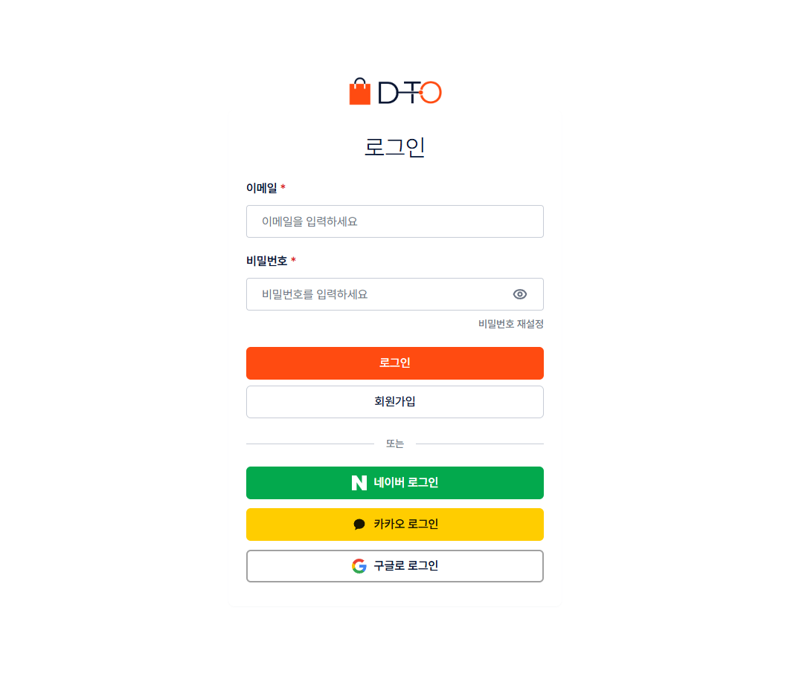
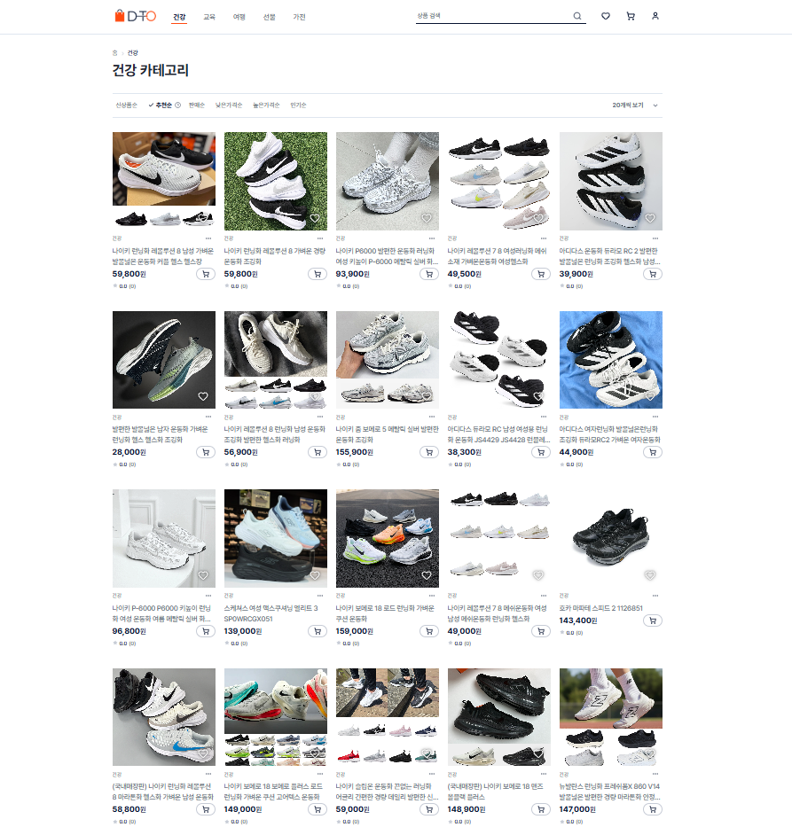
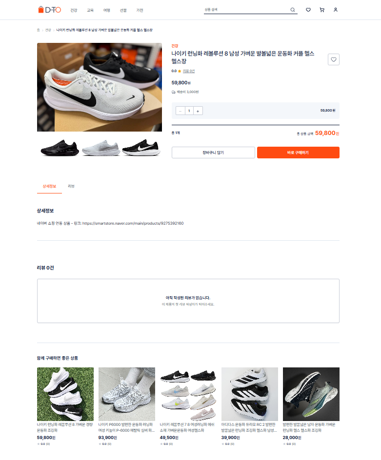
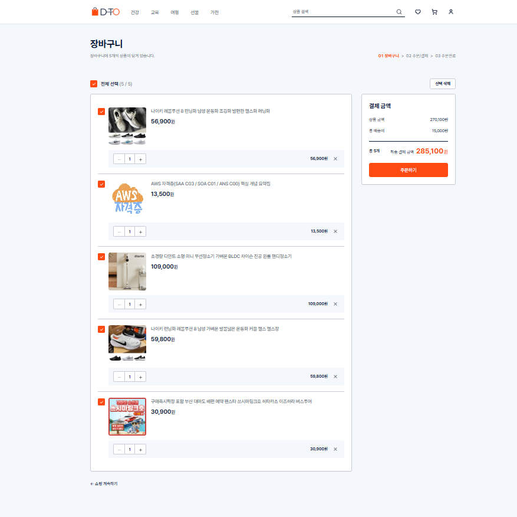
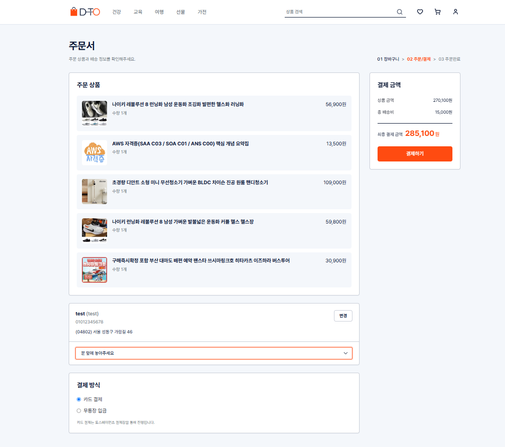
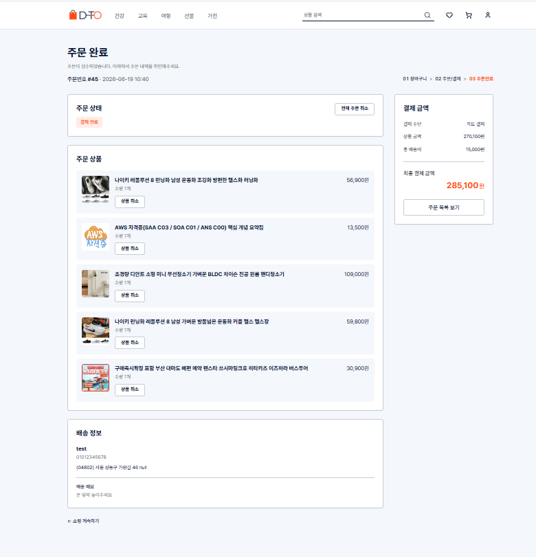
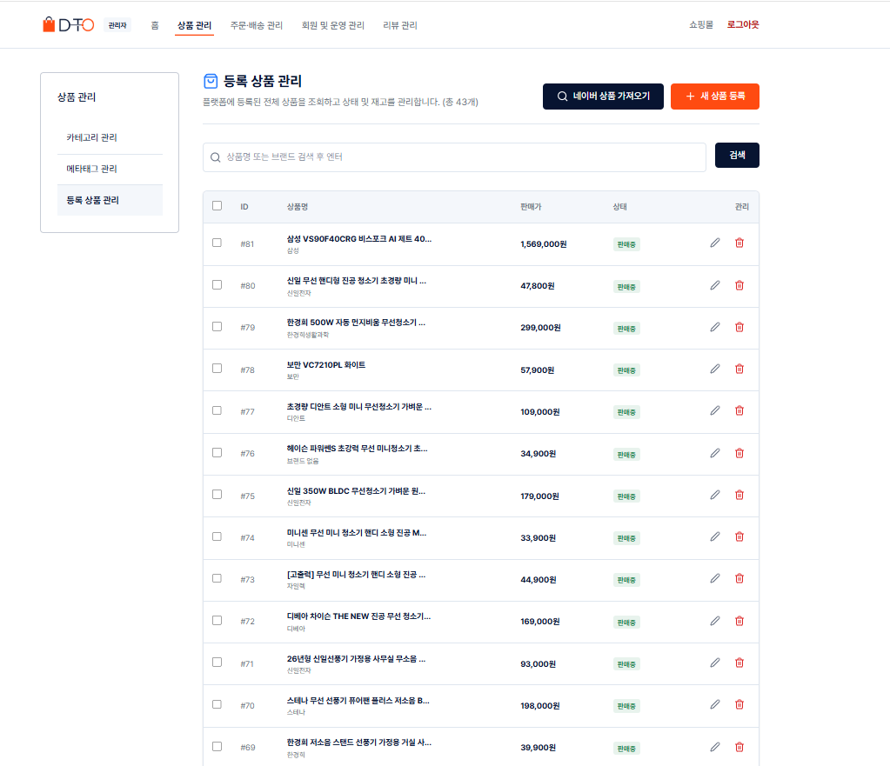
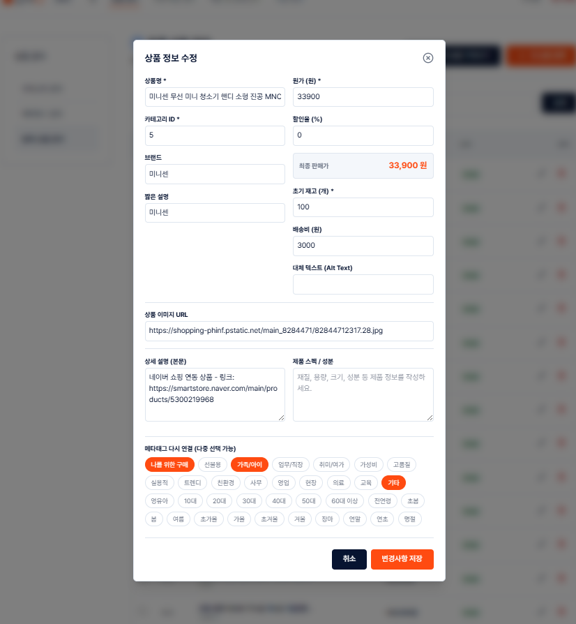
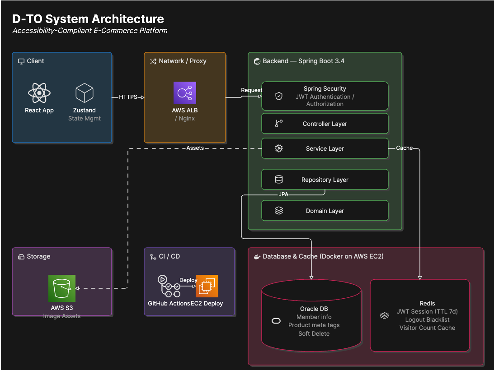
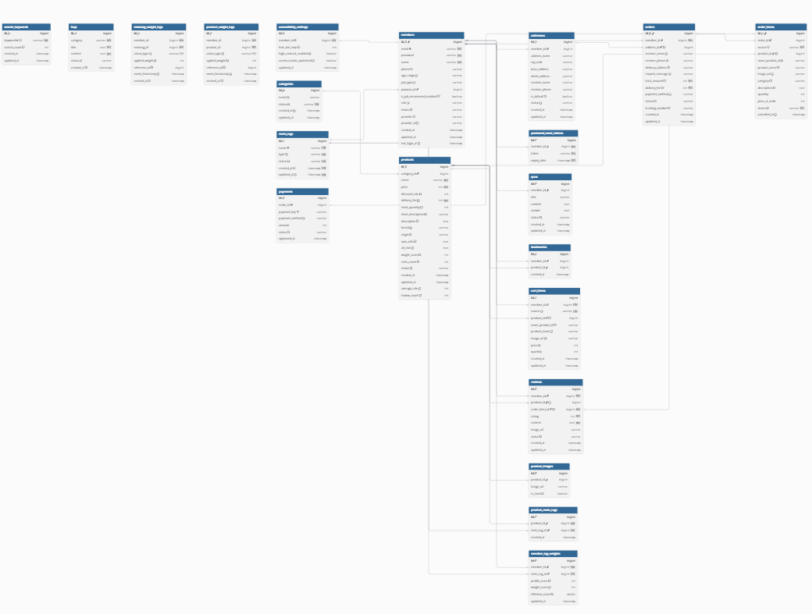

## 📌 프로젝트 개요

D-TO는 직장인을 위한 맞춤형 커머스 플랫폼입니다.

사용자는 상품 조회, 장바구니, 주문 및 결제, 배송 조회, 리뷰 작성 등의 기능을 이용할 수 있으며, 관리자는 상품 및 주문·배송 상태를 효율적으로 관리할 수 있습니다.

특히 단순 상품 판매를 넘어 사용자의 행동 데이터를 분석하여 개인화 추천 서비스를 제공하는 것을 목표로 개발되었습니다.

상품에는 메타태그가 부여되며, 사용자의 상품 조회, 북마크, 장바구니 추가, 주문 등의 활동에 따라 태그별 가중치가 누적됩니다. 이를 통해 사용자의 관심사를 분석하고 맞춤형 상품을 추천할 수 있는 구조를 구현했습니다.

또한 접근성 향상을 위해 상품 이미지 대체 텍스트(Alt Text)를 제공하고, 사용자 환경에 맞는 접근성 설정 기능을 지원합니다.

### 📅 개발 기간

- 2026.05 ~ 2026.06

### 👨‍💻 개발 인원

- 총 3명

---

## ✨ 주요 기능

### 👤 사용자 기능

- 회원가입 및 로그인
- 상품 조회 및 검색
- 장바구니 관리
- 주문 및 결제
- 주문 / 배송 조회
- 리뷰 작성 및 조회
- 마이페이지

### 🎯 개인화 기능

- 메타태그 기반 상품 분류
- 사용자 행동 데이터 수집
- 태그 가중치 관리

### 🛠 관리자 기능

- 상품 관리
- 주문 관리
- 배송 관리
- 네이버 쇼핑 API 상품 등록

---

## 🖥️ 데모 화면

### 로그인

  

### 상품 화면

  
  

### 장바구니

  

### 주문 및 결제

  
  

### 관리자 상품 기능

  
  

---

## 🏗️ 시스템 아키텍처

[Figma 바로가기](https://www.figma.com/design/4ZDsag2J8YmpVDor7GbnDA/D-TO?node-id=0-1&p=f&t=aAoYlDosBIaybdME-0)

---

## 🗄️ ERD

[ERD 바로가기](https://dbdiagram.io/d/Copy-of-Untitled-Diagram-6a2a5e209340ecc06573d84c)

---

## 🛠️ 기술 스택

### Backend

- Java 21
- Spring Boot
- Spring Security
- Spring Data JPA
- JWT
- Oracle Database
- Redis
- Maven

### Frontend

- React
- Vite
- React Query
- Zustand
- Tailwind CSS

### External API

- Toss Payments
- Naver Shopping Search API

### Collaboration

- Git
- GitHub
- Notion
- Discord

---

## 👥 팀원 소개

| 이름 | 담당 |
|------|------|
| 이지수 | 프로젝트 총괄(PM, PL), DB 설계(ERD), API 명세 확립 및 통합 관리 |
| 전이레 | Frontend / Backend Development |
| 정인혁 | Frontend / Backend Development |

---

## 📊 프로젝트 성과 및 아키텍처 명세 (Result & Evidence)

D-TO 프로젝트는 시스템 안정성, 웹 접근성, 그리고 체계적인 인프라 설계를 검증하기 위해 다양한 도구를 활용하여 프로젝트 퀄리티를 관리했습니다.

### 🛡️ 웹 접근성 및 최적화 성과 (Lighthouse)

시각 장애인 및 다양한 사용자 환경을 배포 단계에서 보장하기 위해 상품 이미지 대체 텍스트(Alt Text) 제공 및 스크린 리더 호환성을 확보했습니다. Google Lighthouse 측정 결과, **웹 접근성(Accessibility) 항목 100점**을 달성하며 높은 품질의 상용 웹 서비스 표준을 만족했습니다.

  

### 🔗 상세 아키텍처 및 소스코드 분석 링크

인프라 설계의 무결성과 실시간 분산 환경 검증을 위한 핵심 명세 및 인프라 자동화 관련 상세 자료는 아래 링크에서 확인하실 수 있습니다.

* **[Figma 인프라 아키텍처 전체보기](https://www.figma.com/design/4ZDsag2J8YmpVDor7GbnDA/D-TO?node-id=0-1&p=f&t=aAoYlDosBIaybdME-0)**
* **[dbdiagram.io 실시간 ERD 모델링]([https://dbdiagram.io/d/Copy-of-Untitled-Diagram-6a2a5e209340ecc06573d84c](https://dbdiagram.io/d/Copy-of-Untitled-Diagram-6a2a5e209340ecc06573d84c))**
* **[Notion 통합 API 명세서]([https://www.notion.so/API-34ab3617b6918047b68cca2f660f7db7?source=copy_link](https://www.notion.so/API-34ab3617b6918047b68cca2f660f7db7?source=copy_link))**
* **[Redis + JWT 인증 및 가중치 수집 핵심 소스코드]([https://github.com/](https://github.com/hotdog-team/hotdog-backend))**

---
